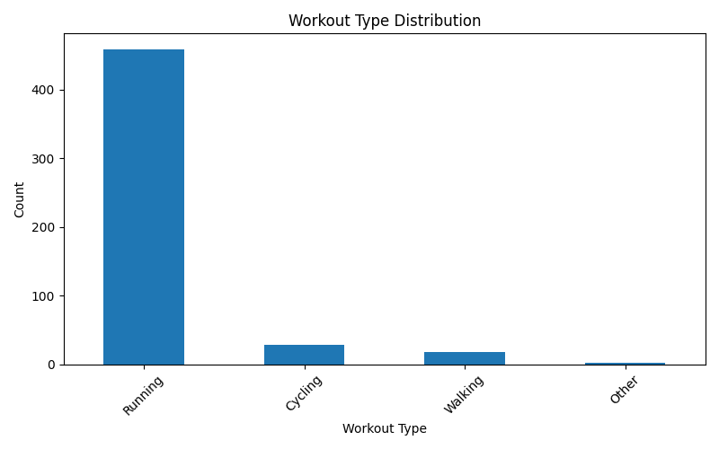
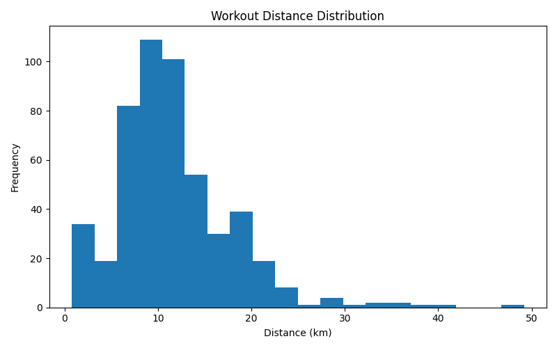
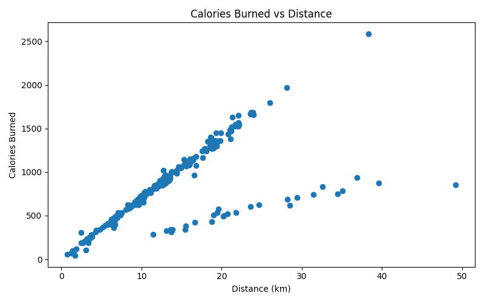
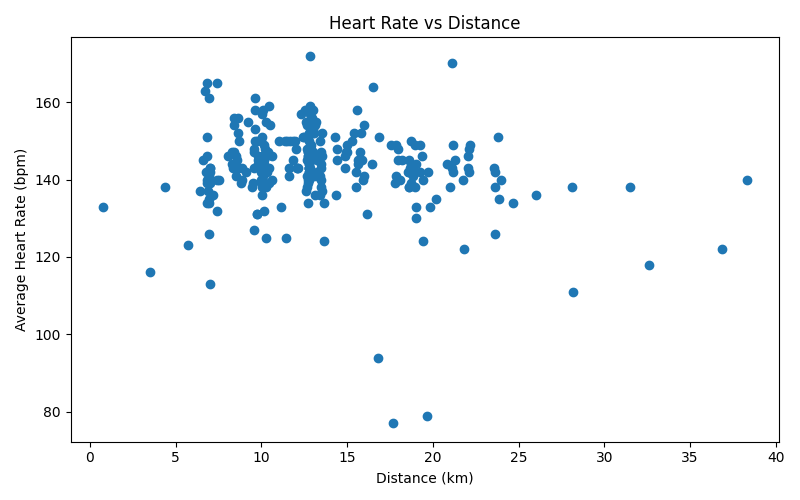
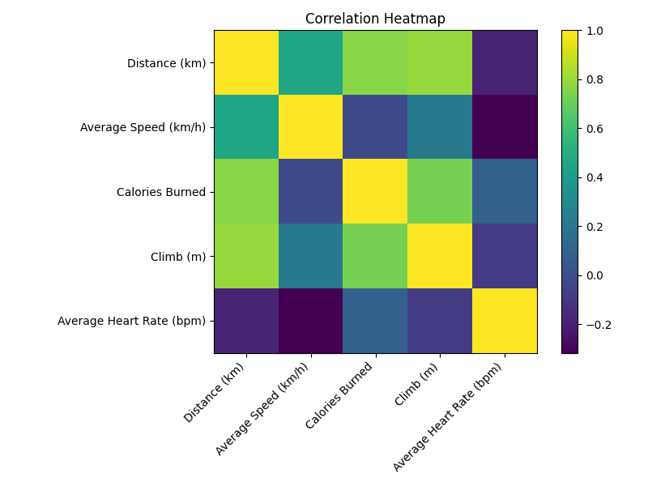
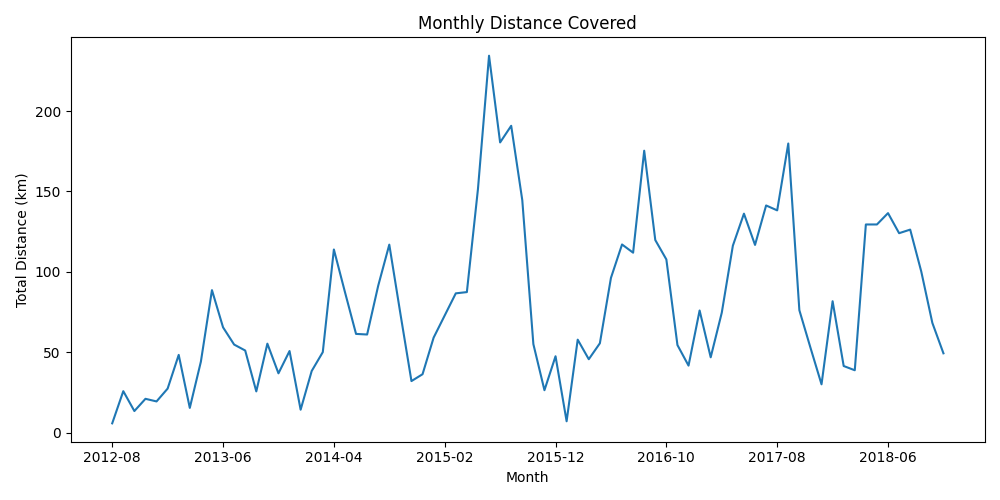

# Cardiovascular Workout Data Analyzer

A Python-based data analytics project that explores and visualizes cardiovascular workout data using Pandas and Matplotlib.

## Sample Visualizations

### Activity Distribution


### Distance Distribution


### Calories Burned vs Distance


### Heart Rate vs Distance


### Correlation Heatmap


### Monthly Distance Trend


## Project Overview

This project analyzes historical workout activity data containing information such as:

- Workout Type
- Distance Covered
- Calories Burned
- Average Speed
- Average Heart Rate
- Elevation Gain (Climb)

The goal is to clean the dataset, perform exploratory data analysis (EDA), identify trends, and generate meaningful visualizations.

---

## Dataset

Dataset Source:

https://www.kaggle.com/datasets/deependraverma13/cardio-activities

Dataset Size:

- 508 workout records
- 14 original features

Workout categories include:

- Running
- Cycling
- Walking
- Other

---

## Technologies Used

- Python
- Pandas
- Matplotlib

---

## Project Structure

```
Cardiovascular_Workout_Data_Analyzer/
│
├── data/
│   ├── cardioActivities.csv
│   └── cleaned_cardio.csv
│
├── images/
│   ├── activity_distribution.png
│   ├── distance_distribution.png
│   ├── calories_vs_distance.png
│   ├── heartrate_vs_distance.png
│   ├── correlation_heatmap.png
│   └── monthly_distance_trend.png
│
├── src/
│   ├── clean_data.py
│   ├── activity_distribution.py
│   ├── distance_distribution.py
│   ├── calories_vs_distance.py
│   ├── heartrate_vs_distance.py
│   ├── correlation_analysis.py
│   ├── correlation_heatmap.py
│   └── monthly_trend.py
│
└── README.md
```

---

## Data Cleaning

The following preprocessing steps were performed:

- Removed unnecessary columns
- Removed extreme outliers in Calories Burned
- Generated a cleaned dataset for analysis
- Verified missing values

### Dataset Size

Before Cleaning:

```
(508, 14)
```

After Cleaning:

```
(503, 13)
```

---

## Key Findings

### Workout Type Distribution

- Running dominates the dataset.
- Cycling and Walking occur much less frequently.

### Distance Distribution

- Most workouts fall between 5 km and 15 km.
- A few long-distance sessions exceed 30 km.

### Calories Burned vs Distance

- Strong positive relationship between distance and calories burned.
- Longer workouts generally burn more calories.

### Heart Rate Analysis

- Heart rate remains relatively stable across different distances.
- No strong relationship between workout distance and average heart rate.

### Correlation Analysis

Strong positive correlations:

| Variables | Correlation |
|------------|------------|
| Distance vs Climb | 0.80 |
| Distance vs Calories Burned | 0.77 |
| Calories Burned vs Climb | 0.73 |

Weak negative correlations:

| Variables | Correlation |
|------------|------------|
| Heart Rate vs Speed | -0.32 |
| Heart Rate vs Distance | -0.19 |

---

## Visualizations

### Activity Distribution

Shows frequency of each workout type.

### Distance Distribution

Histogram of workout distances.

### Calories vs Distance

Scatter plot showing relationship between distance and calories burned.

### Heart Rate vs Distance

Scatter plot analyzing heart rate patterns.

### Correlation Heatmap

Visual representation of feature correlations.

### Monthly Distance Trend

Time-series analysis of monthly training volume.

---

## How to Run

Clone the repository:

```bash
git clone <repository-link>
```

Install dependencies:

```bash
pip install -r requirements.txt
```

Run a script:

```bash
python src/activity_distribution.py
```

---

## Future Improvements

- Interactive dashboards using Plotly
- Machine Learning predictions
- Fitness performance forecasting
- Streamlit web application deployment

---

## Author

Rishikesh Sinha

B.Tech Electronics & Communication Engineering

NSUT